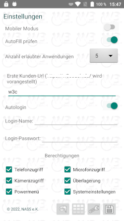

# W3Kiosk
A kiosk-like android web browser with password-protected settings, autostart function and on demand integrated remote support plugins.

Needs android.permission.SYSTEM_ALERT_WINDOW.

adb shell pm grant com.nass.ek.w3kiosk android.permission.SYSTEM_ALERT_WINDOW

 
 