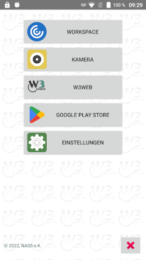

# W3Kiosk
A kiosk-like android web browser with password-protected settings, autostart function and on demand integrated remote support plugins.
If activated the app can update itself from github releases.

Needs android.permission.SYSTEM_ALERT_WINDOW.
```
adb shell pm grant com.nass.ek.w3kiosk android.permission.SYSTEM_ALERT_WINDOW
```
  

 

# Installation
1. Clone this repository by entering this command into *Bash*:
```bash
git clone git@github.com:https://github.com/manfred-mueller/W3Kiosk.git
```
2. Then, open the root project directory in *Android Studio*.

# Build APK or Android App Bundle
1. From *Android Studio*, go to the *Build* menu.
2. Go to the *Build Bundle(s) / APK(s)* menu.
3. Select either *Build APK(s)* or *Build Bundle(s)*.
4. Wait for a notification to pop signifying the operation completion.
5. Select *locate* in the notification to navigate to the file location of the built artifact.
6. Install the artifact on your Android device and try it out.

# Maintainers
This project is maintained by:
* [Manfred Mueller](https://github.com/manfred-mueller)

